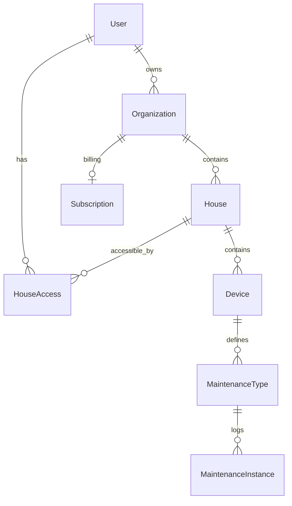

# Spécifications Techniques - Application de Suivi d'Entretien de Maison

Ce document détaille l'implémentation technique et l'infrastructure de l'application, en complément du cahier des charges fonctionnel.

## 1. Stack Technique Détaillée

### 1.1 Backend & API
- **Framework** : ASP.NET Core 10 Web API (C#)
- **Architecture** : Onion Architecture (Clean Architecture)
- **Documentation** : Swagger/OpenAPI intégré
- **ORM** : Entity Framework Core (EF Core) avec Npgsql
- **Authentification** : ASP.NET Core Identity (JWT Bearer)
- **Validation** : FluentValidation ou validation native .NET

### 1.2 Frontend
- **Framework** : Next.js 14+ (React / App Router / TypeScript)
- **Styling** : Tailwind CSS + Shadcn/ui (Design "Consumer Moderne")
- **State Management** : TanStack Query (React Query) + Zustand
- **Authentification** : NextAuth.js v5 (integration avec le backend .NET)

### 1.3 Base de Données
- **Principal** : PostgreSQL
- **Migrations** : EF Core Migrations
- **Schéma Technique** : (Voir section 4 pour le détail des entités)

## 2. Infrastructure et Déploiement

### 2.1 Orchestration
- **.NET Aspire** : Gestion du cycle de vie local et orchestrateur pour le cloud.
- **Docker** : Conteneurisation de chaque service (Frontend, API, Worker).

### 2.2 Hébergement Cloud
- **Azure Container Apps (ACA)** : Hébergement principal via Azure Developer CLI (`azd`).
- **Azure Database for PostgreSQL** : Instance gérée pour la production.
- **Azure Application Insights** : Monitoring et logs centralisés via OpenTelemetry.

### 2.3 CI/CD
- **GitHub Actions** : Pipeline automatisé pour les builds et déploiements vers Azure.
- **Environnements** : 
  - `Production` (branche main)
  - `Staging` (branche develop)
  - `Preview` (sur chaque Pull Request via Azure Container Apps)

## 3. Services Tiers

- **Paiements** : Stripe.NET SDK (Stripe Checkout & Customer Portal).
- **Emails** : Resend ou SendGrid via client SMTP/API .NET.
- **Monitoring** : App Insights et Sentry pour le tracking d'erreurs frontend.

## 4. Schéma de Base de Données (Relations EF Core)

## 5. Estimation des Coûts (Infrastructure)

| Service | Grade / Tier | Coût estimé (MVP) |
|---------|--------------|-------------------|
| Azure Container Apps | Consumption | 0€ (incl. 180k vCPU-s/mois) |
| Azure Database for PostgreSQL | Flexible Server (Basic) | 0€ - 15€/mois |
| Resend (Emails) | Free | 0€ |
| Azure Application Insights | Free Tier | 0€ |
| **Total Estimé** | | **< 15€ / mois** |

---

**Version** : 4.0 - Migration vers .NET 10
**Date** : 2025-12-23  
**Statut** : Validé  
**Auteur** : Antigravity AI
