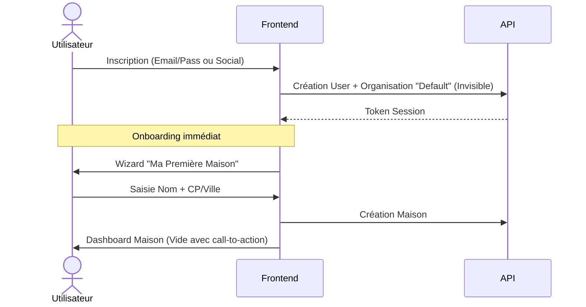

# Flux Utilisateurs (User Flows) - ProjectAI

Ce document décrit les parcours utilisateurs détaillés. L'expérience vise à être fluide ("Consumer Moderne") avec une complexité progressive.

## Principe Directeur : "Low Friction Onboarding"
L'utilisateur doit atteindre la valeur ajoutée (ajouter sa maison et ses équipements) le plus vite possible. La complexité administrative (Organisation, Facturation) est repoussée au moment de l'achat (Upsell).

## 1. Flux d'Onboarding (First Time Experience)

**Concept** : L'organisation est créée implicitement en arrière-plan.

## 2. Gestion des Appareils et Entretiens (Core Features)

L'utilisateur gère son patrimoine technique. Ce flux est disponible pour tous les utilisateurs (Free & Premium).

### 2.1 Ajout d'un Appareil (Device)
*L'unité de base à suivre (ex: Chaudière, Toiture, Détecteur).*

1.  **Déclencheur** : Bouton "Ajouter un appareil" sur le Dashboard Maison.
2.  **Choix du type** :
    *   *Catalogue* : Liste d'icônes (Chauffage, Plomberie, Sécurité, Électroménager).
    *   *Recherche* : "Chaudière gaz", "Poêle à bois".
3.  **Configuration** :
    *   **Nom** : "Chaudière Sous-sol" (Suggéré).
    *   **Marque/Modèle** : Champ texte (Optionnel).
    *   **Date installation** : Date picker (Optionnel).
4.  **Auto-Configuration (Magique)** :
    *   Si l'utilisateur choisit "Chaudière Gaz", le système propose automatiquement le **Type d'Entretien** associé : "Entretien Annuel Obligatoire".
5.  **Validation** : L'appareil est créé, le plan de maintenance est généré.

### 2.2 Gestion des Types d'Entretien (Maintenance Definitions)
*Définir CE QUI doit être fait et QUAND (ex: Ramonage tous les ans).*

*Cas 1 : Création automatique (lors de l'ajout d'appareil).*
*Cas 2 : Ajout manuel.*

1.  **Déclencheur** : Page Détail Appareil -> "Ajouter une tâche récurrente".
2.  **Formulaire** :
    *   **Nom** : ex: "Changement filtres".
    *   **Fréquence** : Select (Annuel, Semestriel, Mensuel, Custom).
    *   **Rappel** : Toggle "M'envoyer un email" (ex: 30 jours avant).
    *   **Alertes légales** : (Future feature) Badge "Obligation légale" si applicable.

### 2.3 Encodage d'un Entretien (Log / Maintenance Instance)
*Valider que l'action a été faite (ex: Le technicien est passé ce matin).*

1.  **Déclencheur** :
    *   *Depuis email de rappel* : Deep link vers la tâche.
    *   *Depuis Dashboard* : Une tâche "À faire" apparaît en haut.
    *   *Spontané* : Bouton "Marquer comme fait" sur un appareil.
2.  **Saisie (Rapide)** :
    *   **Date** : Par défaut "Aujourd'hui".
    *   **Statut** : Fait.
3.  **Saisie (Détaillée/Optionnelle)** :
    *   **Coût** : Montant + Devise.
    *   **Prestataire** : Nom de l'entreprise.
    *   **Preuve** : Upload Photo/PDF (Facture, Attestation).
    *   **Notes** : Remarques textuelles.
4.  **Résultat** :
    *   La tâche passe dans "Historique".
    *   La **prochaine date** est recalculée automatiquement selon la fréquence.

## 3. Collaboration et Partage (Premium Features)

Ces fonctionnalités nécessitent un abonnement actif pour l'Organisation propriétaire de la maison.

### 3.1 Inviter un Collaborateur (Conjoint / Gestionnaire)
*Accès complet en lecture/écriture.*

1.  **Déclencheur** : Paramètres de la Maison -> "Membres".
2.  **Check Premium** : Si Free et quota atteint -> Modal Upsell.
3.  **Action** : "Inviter un co-propriétaire".
4.  **Saisie** : Email.
5.  **Flux Invité** :
    *   Reçoit email.
    *   Création de compte (si inexistant).
    *   Accepte l'invitation.
    *   La maison apparaît dans son Dashboard.
    *   *Droit* : Peut ajouter des appareils, valider des entretiens.

### 3.2 Inviter un Locataire (Tenant)
*Accès "Lecture" et "Signalement".*

1.  **Objectif** : Permettre au locataire de voir les manuels et dates d'entretien (prouver que la chaudière est maintenue).
2.  **Action** : "Inviter un locataire".
3.  **Saisie** : Email.
4.  **Vue Locataire** :
    *   Voit la liste des équipements (Read Only).
    *   Voit l'historique des entretiens passés (Rassurance).
    *   Ne voit PAS les coûts, factures ou infos privées propriétaire (Filtrage des données).
    *   (Optionnel) Peut signaler un incident ("La chaudière fait du bruit").

## 4. Paiement et Scale (Upsell)

### 4.1 Ajout de Résidence (Déclencheur Upsell)
1.  Utilisateur Free essaie d'ajouter une **2ème Maison**.
2.  **Blocage** : Pop-up "Votre plan actuel permet 1 maison".
3.  **Proposition** : "Passez Premium pour gérer illimité + Collaborateurs".
4.  **Checkout** : Stripe.
5.  **Post-Paiement** :
    *   Passage automatique de l'Organisation en statut PREMIUM.
    *   Demande de **Nom d'Organisation** (ex: "SCI Familiale") pour la facture.

### 4.2 Changement de détails Organisation
*Gestion administrative pour les pros/investisseurs.*

1.  **Accès** : Paramètres -> Facturation.
2.  **Actions** :
    *   Renommer l'organisation (visible sur les invitations envoyées).
    *   Mettre à jour l'adresse de facturation.
    *   Voir l'historique des factures Stripe.
    *   Gérer les moyens de paiement (Portail Stripe).

## Résumé des Rôles & Permissions

| Action | Owner (Admin) | Collaborateur (Write) | Locataire (Read) |
| :--- | :---: | :---: | :---: |
| Créer/Supprimer Maison | ✅ | ❌ | ❌ |
| Ajouter Appareil | ✅ | ✅ | ❌ |
| Configurer Entretien | ✅ | ✅ | ❌ |
| Valider Entretien (Log) | ✅ | ✅ | ❌ (sauf si mandaté) |
| Voir Coûts/Factures | ✅ | ✅ | ❌ |
| Inviter Membres | ✅ | ❌ | ❌ |
| Voir Manuels/Ref | ✅ | ✅ | ✅ |
